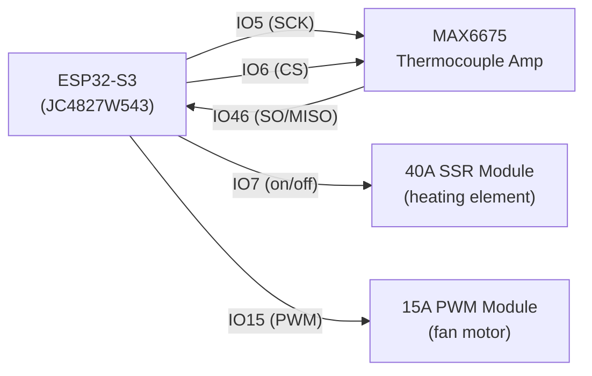

# Pop Roaster Firmware

ESP-IDF firmware for the Pop Roaster coffee roaster controller, running on a
Guition JC4827W543 board (ESP32-S3-WROOM-1-N4R8, 480x272 NV3041A display,
GT911 capacitive touch). Provides an on-device touchscreen UI, a WiFi web
dashboard, Artisan roasting-software integration (Modbus TCP), roast
profile/preset management, session history, and OTA updates.

Full requirements/design docs live in
[`specs/001-pop-roaster-control/`](../specs/001-pop-roaster-control/)
(`spec.md`, `plan.md`, `tasks.md`, `quickstart.md`).

## Requirements

- ESP-IDF v6.0 (this project has not been tested against other major
  versions; several fixes in this codebase specifically address v6.0 API
  changes — see `/memories/repo/firmware-build-notes.md` if you have access
  to it, otherwise check git history of this file).
- Target chip: `esp32s3`.
- A Guition JC4827W543 board (or a board with the same NV3041A/GT911/pin
  layout — see `components/board_config/boards/board_jc4827w543.h`).

## Building and flashing

```powershell
cd firmware
idf.py set-target esp32s3
idf.py build
idf.py -p <PORT> flash monitor
```

If you are using the VS Code ESP-IDF extension, open the `firmware/` folder
directly as the workspace root (not the repo root) — the extension expects
`CMakeLists.txt`/`sdkconfig` at the workspace root.

Flash size is 4MB (`CONFIG_ESPTOOLPY_FLASHSIZE_4MB`, already set in
`sdkconfig.defaults`). Partition layout is defined in
[`partitions.csv`](partitions.csv): dual OTA app slots (`ota_0`/`ota_1`,
1.5MB each) plus a LittleFS `storage` partition (~896KB) for roast session
history.

## Hardware wiring

### Display & touch (fixed, on-board — no wiring needed)

The NV3041A display (QSPI) and GT911 touch controller (I2C) are soldered
directly to the JC4827W543 board. Pin assignments are fixed in
[`components/board_config/boards/board_jc4827w543.h`](components/board_config/boards/board_jc4827w543.h)
and are not user-configurable.

### External peripherals (user-wired via JST1.25 expansion connectors)

The board exposes 4 JST1.25 4-pin expansion connectors. Confirmed physical
pinout:

| Connector | Pin 1 | Pin 2 | Pin 3 | Pin 4 |
|-----------|-------|-------|-------|-------|
| P1 | GND | RXD | TXD | +5V |
| P2 | IO46 | IO9 | IO14 | IO5 |
| P3 | IO6 | IO7 | IO15 | IO16 |
| P4 | GND | 3.3V | IO17 | IO18 |

> **Note:** IO46 is **input-only** on the ESP32-S3 — it must never be
> assigned to an output signal (SSR, fan PWM). It is used by default for
> the MAX6675's read-only SO/MISO line.

Default GPIO assignments (configurable via `idf.py menuconfig` →
**Pop Roaster Board Configuration** → **External Peripheral GPIOs**, see
[`components/board_config/Kconfig`](components/board_config/Kconfig)):

| Signal | Default GPIO | Connector/pin | Notes |
|--------|--------------|----------------|-------|
| MAX6675 SCK (clock) | IO5 | P2, pin 4 | |
| MAX6675 CS (chip select) | IO6 | P3, pin 1 | |
| MAX6675 SO / MISO | IO46 | P2, pin 1 | Input-only pin, read-only signal — safe pairing |
| SSR heater control (on/off) | IO7 | P3, pin 2 | Drives a **40A SSR module** controlling the heating element; time-proportioning (duty cycle) is done in software over this single digital output |
| Fan PWM control | IO15 | P3, pin 3 | Drives a **15A PWM module** controlling the fan motor; 20kHz default switching frequency (inaudible), LEDC timer 1 / channel 1 |

Spare GPIOs not assigned by default (available for future peripherals, e.g.
fan RPM feedback): IO9, IO14, IO16, IO17, IO18.

### Wiring summary



> **Safety:** the SSR and PWM modules switch mains-voltage/high-current
> loads (heating element, fan motor). Follow the module manufacturer's own
> isolation/wiring instructions, use appropriately rated wiring/connectors
> for the actual heater/fan current draw, and ensure proper enclosure and
> earthing. This firmware's software safety interlocks (below) are **not** a
> substitute for correct electrical installation.

## Software safety interlocks (summary)

See [`components/safety/safety_manager.c`](components/safety/safety_manager.c)
and `specs/001-pop-roaster-control/spec.md` for full details. Highlights:

- Heater requires fan ≥ 30% to be commanded on at all.
- Fan cannot be commanded to 0% while bean temperature ≥ 100°C (or the
  sensor reading is invalid — treated conservatively as "still hot").
- Sensor-failure detection forces the heater off.
- Duration watchdog auto-starts Cooling if a roast exceeds the configured
  maximum duration.
- Indirect fan-failure detection (anomalous rate-of-rise) forces the heater
  off and raises a critical alarm.
- Critical alarms require an explicit operator acknowledgement before any
  new heater command is accepted again.
- Emergency Stop (always visible on every screen/tab, and on the web
  dashboard) immediately cuts the heater and cancels the active session.

## Security considerations

This firmware is designed for a **trusted local network** (FR-021 in
`spec.md`): the web dashboard, Artisan Modbus TCP bridge, and OTA update
endpoint have **no authentication or transport encryption** (plain HTTP,
plain Modbus TCP). This is an explicit v1 design decision, not an oversight,
matching the project's "single-operator LAN appliance" scope. Concretely:

- **No login/auth on any web route** — anyone who can reach the device's IP
  on the local network can view telemetry, change fan/heater setpoints,
  start/cancel roasts, edit/delete presets, or trigger a firmware OTA
  upload. Do not expose this device's ports to the public internet (no port
  forwarding, no VPN-less remote access) — treat it like any other
  unauthenticated LAN appliance (e.g. a smart-home hub with no cloud
  account).
- **WiFi setup AP is open** (`WIFI_AUTH_OPEN`, in
  [`components/roaster_hal/wifi_provisioning.c`](components/roaster_hal/wifi_provisioning.c)) —
  it only exists transiently during initial provisioning; anyone in range
  could join it and submit different home-WiFi credentials during that
  window. Complete provisioning promptly after powering on a new device in
  an untrusted location.
- **Artisan Modbus TCP bridge** (`components/artisan_adapter/`) has no
  authentication either — any Modbus TCP client on the LAN can read
  telemetry registers, and (depending on mode) issue control writes. This
  mirrors how Artisan's own Modbus/serial integrations are normally used
  (a single roaster + a single laptop on the same bench network).
- **OTA firmware upload**
  ([`components/web_api/ota_routes.c`](components/web_api/ota_routes.c),
  [`components/roaster_hal/ota_manager.c`](components/roaster_hal/ota_manager.c)):
  any device on the LAN that can reach the web server can push a new
  firmware image. The uploaded image's integrity (magic bytes, header,
  checksum) is validated by `esp_ota_end()` **before** the boot pointer is
  switched to the new partition — a corrupt/incomplete/truncated upload is
  rejected and the device keeps running its current, known-good firmware.
  There is no cryptographic signature check on the image itself (ESP-IDF's
  Secure Boot / signed-app-image feature is not enabled in this project) —
  anyone who can reach the OTA endpoint can flash arbitrary firmware, not
  just an authentic Pop Roaster build. If you need to defend against a
  hostile actor on the same LAN (not just accidental misuse), evaluate
  enabling ESP-IDF Secure Boot + signed OTA images and/or putting the
  device on an isolated VLAN.
- **Recommended deployment**: keep the device on a home/workshop LAN behind
  a normal consumer router's NAT (no port forwarding), and treat the WiFi
  network itself (WPA2/WPA3 password) as the actual security boundary for
  this appliance — consistent with the constitution's stated trust model.

## Internationalization (i18n)

The on-device UI supports English (default), Portuguese, and Spanish via
compile-time string catalogs in
[`components/ui_display/i18n.c`](components/ui_display/i18n.c). Language
choice is switchable from **Config → Language** and persists across
reboots (NVS). Currently only the navigation sidebar and Config screen text
are localized end-to-end; a full per-screen retrofit of every remaining
label is not yet done (see `specs/001-pop-roaster-control/tasks.md` T055
notes).

## Artisan integration

See [`docs/artisan-integration.md`](docs/artisan-integration.md) for
step-by-step Artisan roasting-software setup instructions (Modbus TCP).
